<div align="center">

# Employee Attrition Risk

<a href="https://git.io/typing-svg"></a>

<p>
  A Streamlit dashboard for exploring IBM's HR attrition data, comparing models,
  and turning an employee profile into an explainable risk screen.
</p>

<p>
  <a href="https://www.python.org/"></a>
  <a href="https://streamlit.io/"></a>
  <a href="https://scikit-learn.org/"></a>
  <a href="LICENSE"></a>
</p>

<!-- TODO: Replace this placeholder with a short screen recording or demo GIF. -->
<p><em>Demo GIF placeholder: add <code>assets/demo.gif</code> here when a recording is ready.</em></p>

</div>

> **The short version:** this project puts the data, the model comparison, and the prediction form in one place. A high-risk score is a reason to check in with someone, not a verdict about them.

## What is inside

The app has four focused pages:

- [x] **Home**: the base rate, headline findings, and model choice.
- [x] **Data Exploration**: attrition by department, role, income, tenure, overtime, age, satisfaction, and correlations.
- [x] **Model Performance**: four candidate models, cross-validation metrics, held-out test metrics, and coefficient-based drivers.
- [x] **Predict Attrition**: enter a complete employee profile and get a probability, risk category, and key drivers.

The dataset contains **1,470 employees**. **237 left**, for an overall attrition rate of **16.12%**.

## The numbers worth noticing

| Finding | Result |
| --- | ---: |
| Overtime attrition | **30.5%** with overtime vs **10.4%** without |
| Highest-risk job role | **Sales Representative: 39.8%** |
| Selected model | **Logistic Regression** |
| Cross-validated ROC-AUC | **0.829** |
| Held-out test ROC-AUC | **0.813** |
| Held-out test recall | **0.681** |

Accuracy alone would make the tree-based models look attractive. That would miss the point here: the selected model catches more likely leavers, accepting more false alarms. On the held-out test set, precision is **0.400**, so use the result to start a conversation rather than automate a decision.

## See the data

<p align="center">
  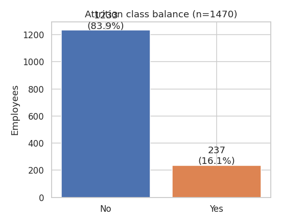
  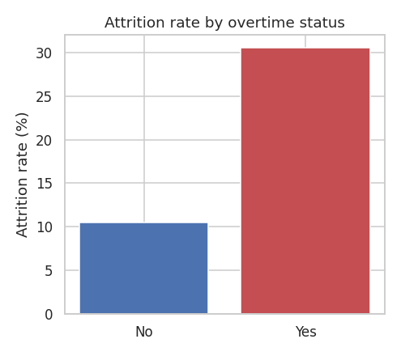
</p>

<p align="center">
  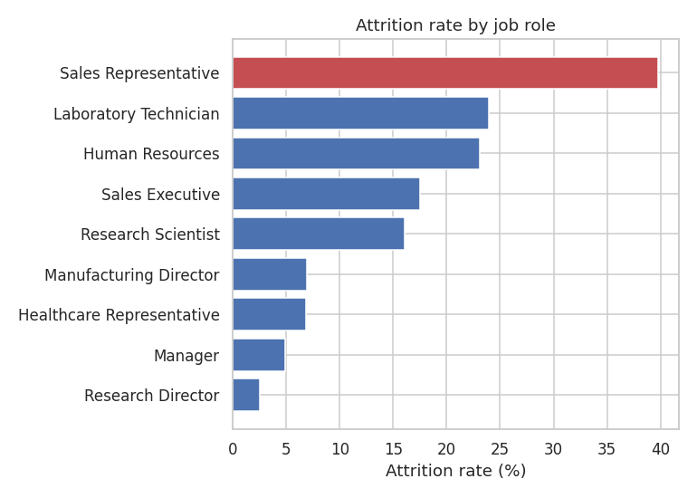
  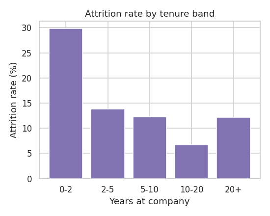
</p>

**Read these charts with the sample size in mind.** Attrition drops through the first 10 years, then rises slightly for employees with 20+ years at the company. That last group is small, so it is a useful pattern to inspect, not a broad rule to apply.

<details>
<summary><strong>More generated charts</strong></summary>

<p align="center">
  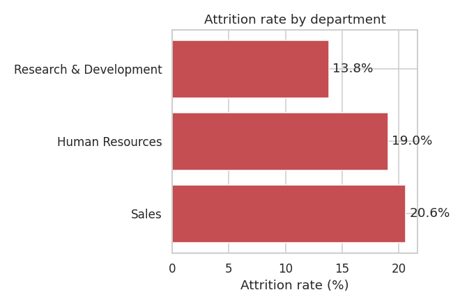
  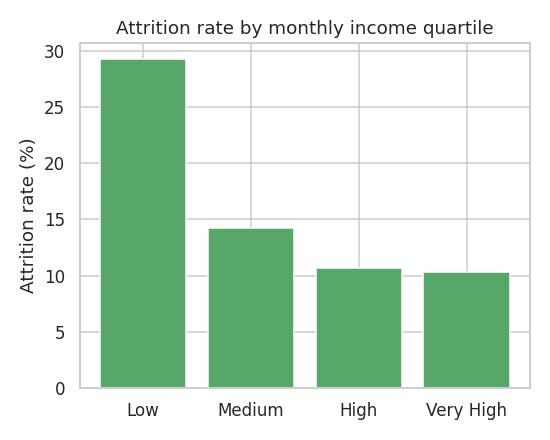
</p>

<p align="center">
  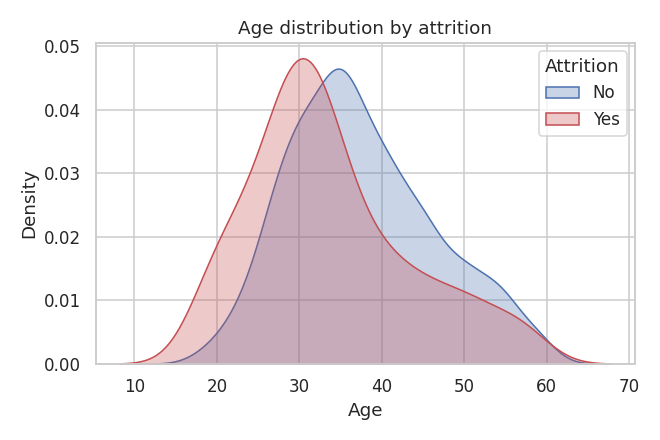
  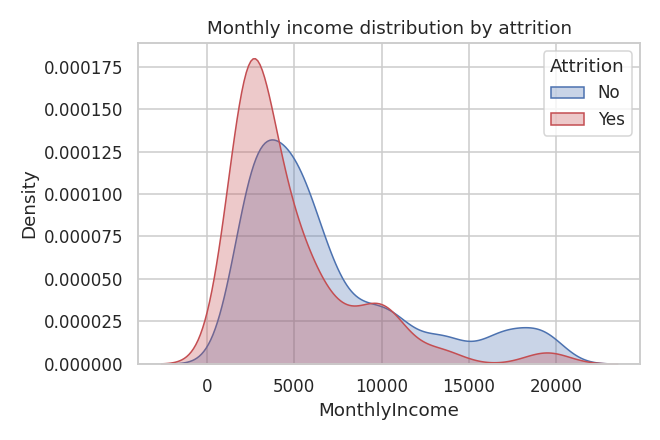
</p>

<p align="center">
  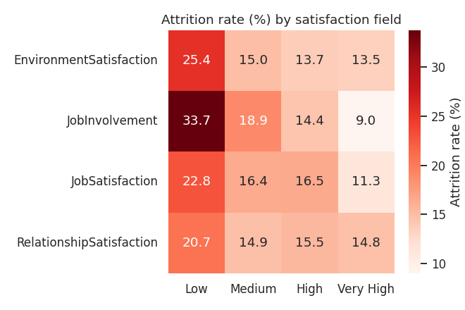
  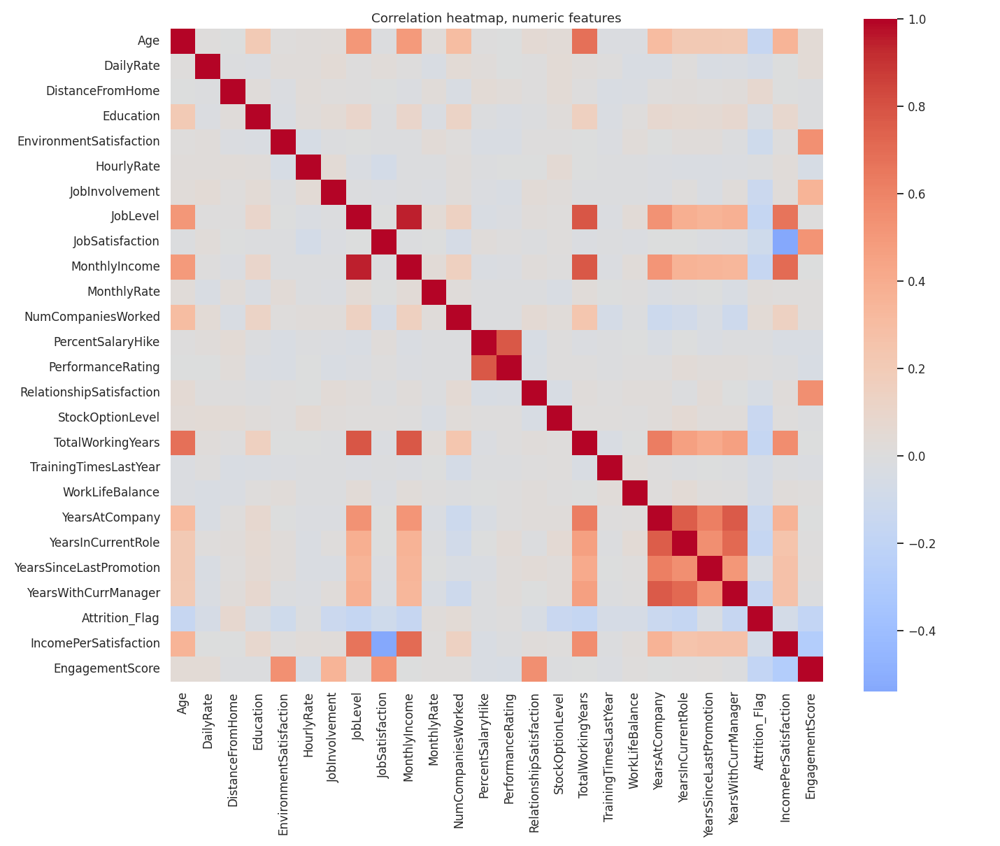
</p>

</details>

## Model comparison

Every candidate uses the same preprocessing and a stratified 5-fold cross-validation setup. SMOTE runs inside each training fold, never on the held-out test data.

| Model | Accuracy | Precision | Recall | F1 | ROC-AUC |
| --- | ---: | ---: | ---: | ---: | ---: |
| **Logistic Regression** | **0.7933** | 0.4218 | **0.6947** | **0.5233** | **0.8287** |
| Random Forest | 0.8741 | **0.7411** | 0.3474 | 0.4650 | 0.8262 |
| XGBoost | **0.8758** | 0.7131 | 0.3895 | 0.4993 | 0.8089 |
| Decision Tree | 0.7976 | 0.3844 | 0.4053 | 0.3853 | 0.6509 |

<p align="center">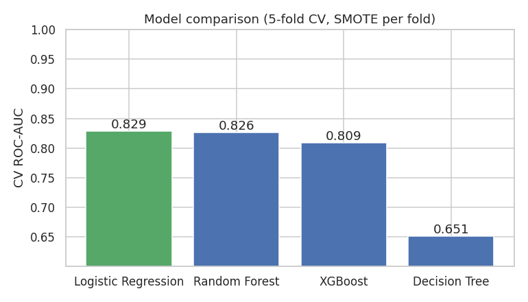</p>

Logistic Regression wins on ROC-AUC by a small margin and gives us coefficients we can inspect. The model also uses four engineered features: `TenureBand`, `AgeBand`, `IncomePerSatisfaction`, and `EngagementScore`. The held-out AUC improves from **0.7965** without them to **0.8134** with them.

<details>
<summary><strong>What pushes the score up or down?</strong></summary>

<p align="center">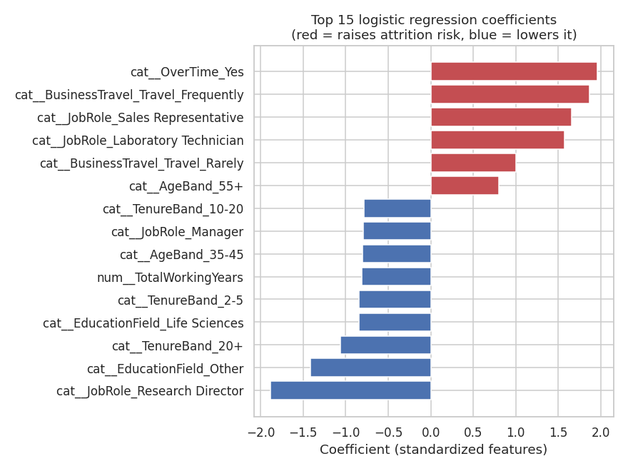</p>

The strongest upward signals include overtime, frequent travel, Sales Representative, and Laboratory Technician roles. Longer tenure, Manager and Research Director roles, and some education fields pull the score down in this fitted model. These are associations in this dataset, not causal explanations.

</details>

## Quick start

### 1. Create an environment

```bash
python -m venv .venv
```

Activate it:

```bash
# macOS / Linux
source .venv/bin/activate

# Windows PowerShell
.venv\Scripts\Activate.ps1
```

### 2. Install dependencies

```bash
python -m pip install -r requirements.txt
```

### 3. Train, generate, and run

```bash
python train_model.py
python generate_figures.py
streamlit run app.py
```

Open the local URL printed by Streamlit, then try the **Predict Attrition** page. The form collects every feature used by the model; there are no hidden placeholder values.

<details>
<summary><strong>Run the app checks</strong></summary>

```bash
python test_app.py
```

The test renders all four pages and submits the prediction form with overtime enabled to verify that a real prediction, risk category, and driver list appear.

</details>

## Project map

```text
employee-attrition-prediction/
├── app.py                         # Streamlit dashboard and prediction form
├── train_model.py                 # Cleaning, feature engineering, training
├── generate_figures.py            # Rebuilds charts and metrics.json
├── test_app.py                    # Streamlit AppTest smoke test
├── data/
│   └── WA_Fn-UseC_-HR-Employee-Attrition.csv
├── notebooks/
│   └── Employee_Attrition_Analysis.ipynb
├── assets/                        # README and dashboard charts
├── requirements.txt
└── LICENSE
```

<details>
<summary><strong>Why was this rebuilt?</strong></summary>

The original notebook stopped at the encoding step because it referenced undefined `target` and `df_encoded` variables. That meant the training, evaluation, and artifact-saving cells never ran. The rebuild makes the pipeline explicit:

1. Load the CSV with a relative path.
2. Drop constant and identifier columns.
3. Keep ordinal survey fields as their raw numeric codes for modeling.
4. Build and test the four engineered features used by the app.
5. Apply SMOTE only inside training data and cross-validation folds.
6. Compare four models, save the selected pipeline, and expose its metrics.

The app and notebook share the same `ORDINAL_LABELS` mapping for display. The labels never enter the model, which avoids a train/serve mismatch between the UI and the fitted pipeline.

</details>

## Limitations

- This is a screening model trained on one public dataset, not a general HR decision system.
- The data is imbalanced and the positive class is relatively small.
- A false positive is expected because recall is prioritized.
- Model coefficients show associations, not causes.
- Do not use the score as the sole basis for employment decisions.

## License

MIT. See [LICENSE](LICENSE).
